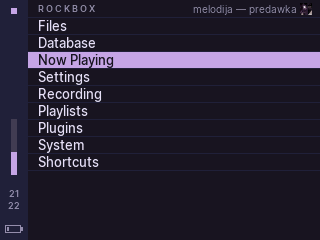
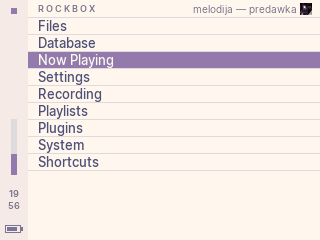
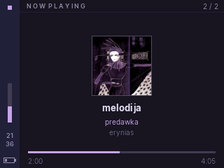
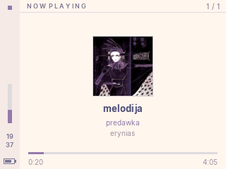
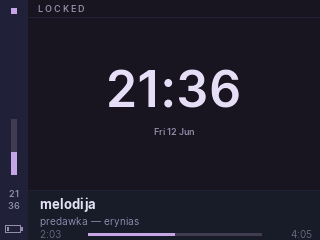
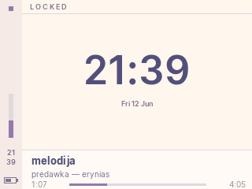

# Iris

A [Rose Pine](https://rosepinetheme.com/) theme for [Rockbox](https://www.rockbox.org/), made for 320×240 color players. Comes in two variants: **Iris** (Rose Pine, dark) and **Iris Dawn** (Rose Pine Dawn, light).

| | Iris | Iris Dawn |
|---|---|---|
| Menu |  |  |
| Now playing |  |  |
| Lock screen |  |  |

## Features

- Lock screen with a big clock and track info
- Sidebar with volume level, clock, and battery, visible on every screen
- Topbar with per-screen titles and the currently playing track info
- Now playing screen with album art, track metadata and seek bar
- [Inter](https://rsms.me/inter/) typeface throughout, converted to Rockbox bitmap fonts
- Drawn entirely with skin-engine primitives, no bitmap assets used except one transparent iconset

## Installation

1. Copy the `.rockbox` directory to the root of your player (merge with the existing one).
2. On the player, go to: **Settings -> Theme Settings -> Browse Themes** and pick `iris` or `iris-dawn`.
3. Optional, for the thin row separators as in the screenshots: set **Settings -> Theme Settings -> List Separator** to 1 px (Rockbox does not let themes change this setting).

Made for 320×240 devices (EROS Q / EROS K native, iPod Video / 6G / Color, and others).

## License

Theme is MIT licensed. The bundled fonts are derived from [Inter](https://github.com/rsms/inter) and remain under the SIL Open Font License (see `.rockbox/fonts/Inter-License.txt`). Color palette by [Rose Pine](https://rosepinetheme.com/).
