# Iris

A [Rose Pine](https://rosepinetheme.com/) theme for [Rockbox](https://www.rockbox.org/), made for 320×240 color players.

Comes in four variants. Two in Rose Pine's own palette, and two neutral counterparts that keep the exact same layout with the hue dialled back:

| | Iris | Iris Dawn |
|---|---|---|
| Menu | 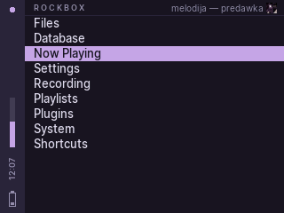 | 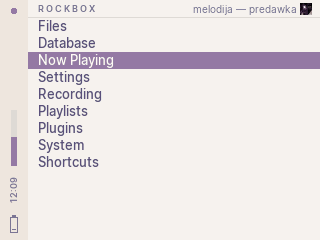 |
| Now playing | 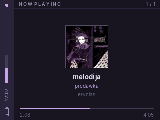 | 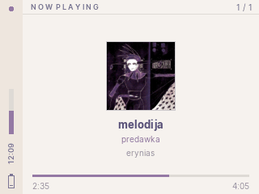 |
| Lock screen | 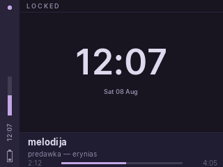 | 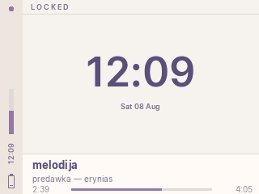 |

| | Iris Night | Iris Morning |
|---|---|---|
| Menu | 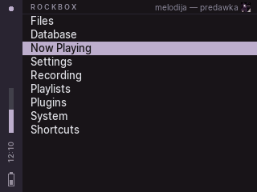 | 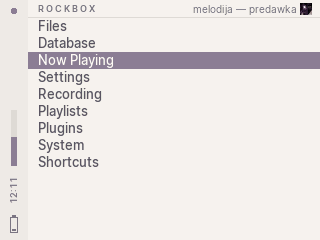 |
| Now playing | 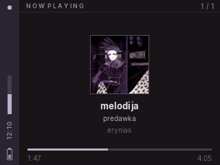 | 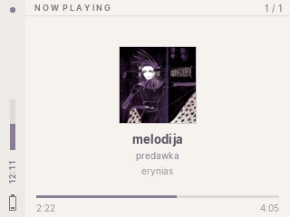 |
| Lock screen | 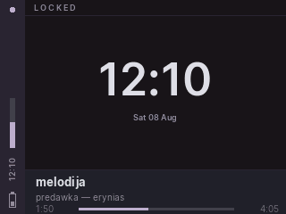 | 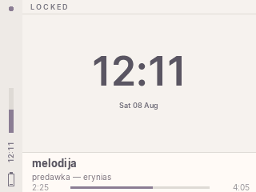 |

The accent dot at the top of the sidebar doubles as a playback indicator, so play state is visible on every screen:

| Playing | Paused | Stopped |
|---|---|---|
|  |  | 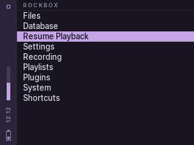 |

## Features

- Lock screen with a big clock and track info
- Sidebar with playback state, volume level, clock, and battery, visible on every screen
- Playback state doubles as the sidebar's accent dot: circle when playing, solid square when paused, hollow square when stopped
- Topbar with per-screen titles and the currently playing track info
- Now playing screen with album art, track metadata and seek bar
- [Inter](https://rsms.me/inter/) typeface throughout, converted to Rockbox bitmap fonts

Everything is drawn with skin-engine primitives except two things: a transparent iconset used to indent list rows, and the sidebar clock, which is a set of pre-rendered bitmap strips because the skin engine can only draw text horizontally.

## Installation

Each variant is a self-contained tree, so you only need the one you want:

```
iris/.rockbox          iris-night/.rockbox
iris-dawn/.rockbox     iris-morning/.rockbox
```

1. Copy the `.rockbox` folder from your chosen variant to the root of your player, merging with the existing one.
2. On the player, go to: **Settings → Theme Settings → Browse Themes** and pick `iris`, `iris-dawn`, `iris-night` or `iris-morning`.

Installing several is fine — they ship identical fonts and iconset, so merging them adds no extra space on the player beyond each theme's own skin files.

Made for 320×240 devices (EROS Q / EROS K native, iPod Video / 6G / Color, and others).

## License

Theme is MIT licensed. The bundled fonts are derived from [Inter](https://github.com/rsms/inter) and remain under the SIL Open Font License (see `.rockbox/fonts/Inter-License.txt`). Color palette by [Rose Pine](https://rosepinetheme.com/).
